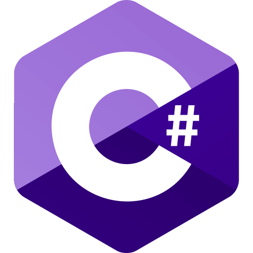
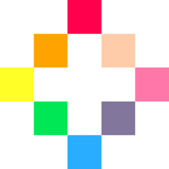
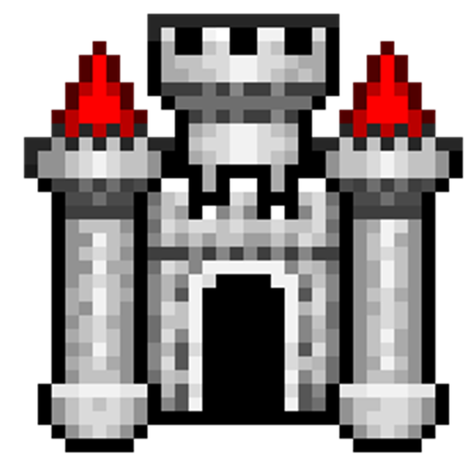
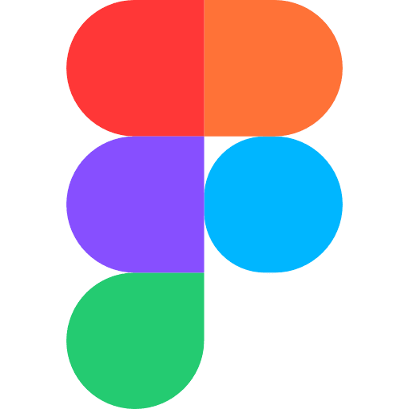
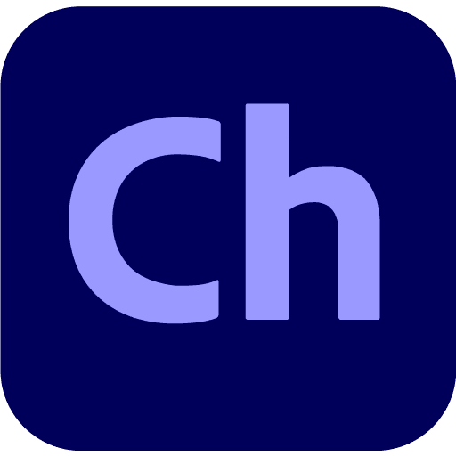

# Hi there, I'm Wilber Alves 🧪🌍🌿🧬🔬🕹️💻

  I'm a 40-hour full-time EBTT Biology teacher at **[CEFET/RJ – Maracanã](https://www.cefet-rj.br "Federal Center for Technological Education Celso Suckow da Fonseca")**, with a Master's and Doctorate in Biochemistry from **[UFRJ](https://www.iq.ufrj.br "Federal University of Rio de Janeiro")** and a specialization in Digital Education from **[UniSENAI/SC](https://cursos.sesisenai.org.br/pos-graduacao/posgraduacao-em-educacao-digital/367 "National Service for Industrial Training - Santa Catarina")**. Currently, I focus my studies on game development, as a student at **[EBAC](https://ebaconline.com.br "British School of Creative Arts & Technology")** (Profession: Game Designer and Unity Developer), **[ECDD](https://ecdd.com.br/faculdade/jogos-digitais-ead/ "School of Computing and Digital Development")** (Digital Games Technologist), and **[EduTec-UFSCar](https://www.edutec.ufscar.br "Education and Technologies Postgraduate Program at UFSCar")** (Postgraduate _lato sensu_ Education and Technologies - Specialization in Games, Gamification and Innovation in Education). I coordinate the **EDGEE/OIKSTUDIO** Teaching Project, an independent studio for the development of *Serious Games* and *Edutainment* focused on Biology and Environmental Sciences.

---

### 💼 Contact and academic production

  
  &nbsp;&nbsp;
  
  &nbsp;&nbsp;
  
  &nbsp;&nbsp;
  

---

### 🕹️ Game Development & Technologies

💾 **Languages:**

   &nbsp;&nbsp;

⚙️ **Engines:**

  
   &nbsp;&nbsp;
  
   &nbsp;&nbsp;
  

🛠️ **Tools:**

  
     &nbsp;&nbsp;
  
     &nbsp;&nbsp;
  
     &nbsp;&nbsp;
  
     &nbsp;&nbsp;
  
     &nbsp;&nbsp;
    
     &nbsp;&nbsp;
  
     &nbsp;&nbsp;
  
     &nbsp;&nbsp;
  
     &nbsp;&nbsp;
  
     &nbsp;&nbsp;
  
     &nbsp;&nbsp;
  
     &nbsp;&nbsp;
  
     &nbsp;&nbsp;

---

### ⚡ Prototypes and Projects

  
🦠**Beakers & Bacteria - Game Developed in PICO-8**

❄️🔥**Chill, Will! Chill! -  Game Developed in PICO-8**

📱**Mobile_Hypercasual_Game - "Nano Delivery Rush" Game Developed in Unity 3D**

🧫**aMAZEcells - Game Developed in Unity 3D** - - - PLAY - https://wilber-alves.itch.io/amazecells (link to the game prototype on itch.io)

❄️🔥**Platformer-2D - Project Developed in Unity 2D** - - - PLAY - https://wilber-alves.itch.io/chill-will-chill-prototype (Link to the game prototype on itch.io)

🏓**Pong Clone - Project Developed in Unity 2D**

🕹️**Adventure 3D Game - Project Developed in Unity 2D**

---

## 📊 GitHub Statistics

 

 

